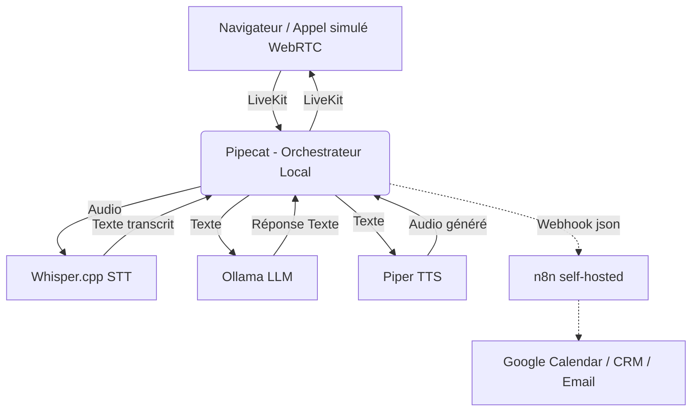

# Architecture

## Stack 100% Gratuite / Self-Hosted

Cette architecture est conçue pour être entièrement gratuite et auto-hébergée, sans nécessiter de carte bancaire ou de crédits payants.

*   **Téléphonie / Réception d'appel** : **LiveKit self-hosted**. Nous simulons la ligne téléphonique avec un appel WebRTC via un navigateur. Cela reproduit fidèlement un flux d'appel pour un prototype.
*   **Orchestration temps réel vocal** : **Pipecat**. Orchestrateur open source gratuit gérant le pipeline complet avec LiveKit (STT -> LLM -> TTS) et les interruptions.
*   **STT (Speech-to-Text)** : **Whisper.cpp** (local). Modèle local fonctionnant sur CPU (modèle `small` ou `medium` français) pour équilibrer vitesse et précision.
*   **LLM** : **Ollama en local** (`llama3.1:8b` ou `mistral:7b`).
*   **TTS (Text-to-Speech)** : **Piper TTS** (local).
*   **Base de données** : **SQLite**. Parfait pour un prototype local sans infrastructure.
*   **Automatisation des tâches (Agenda, CRM, Mail)** : **n8n self-hosted** via Docker. Utilisation d'un SMTP Gmail et l'API gratuite de Google Calendar.
*   **Hébergement** : Développement entièrement en local.

**Note explicite : Coût total de l'infrastructure : 0 DH — stack 100% open source et auto-hébergée.**

## Flux

